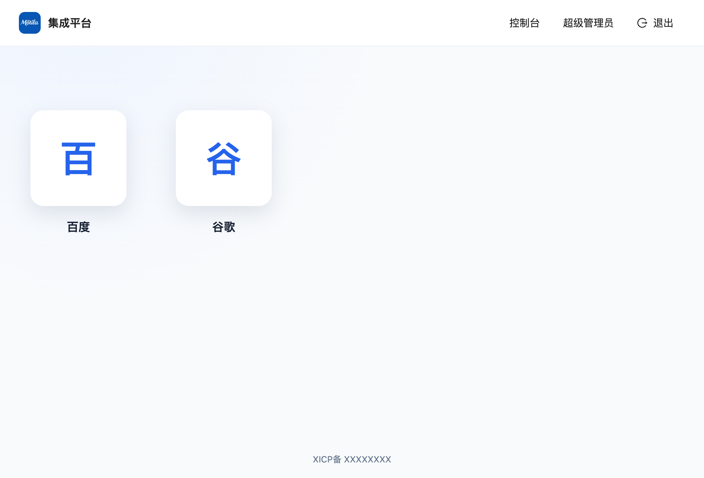
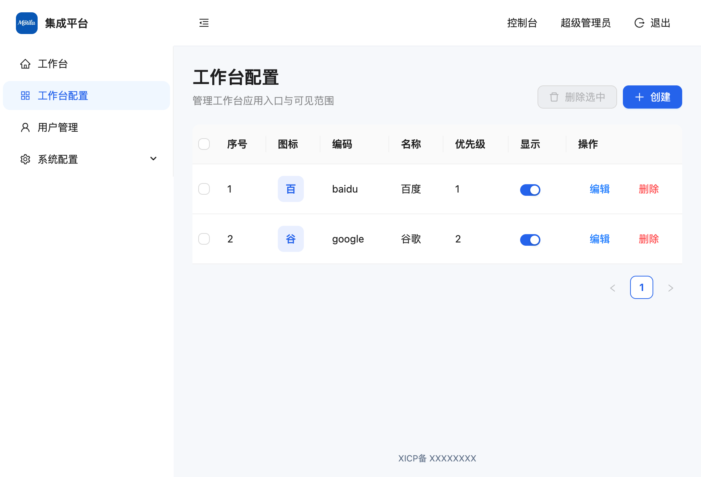

# 集成平台

一个面向企业内部系统的统一登录与工作台平台，提供用户认证、应用入口、权限控制、系统配置和单点登录管理。

## 核心能力

- **统一工作台**：以应用磁贴展示业务系统，支持应用排序、启停、图标和用户可见范围。
- **用户与权限**：支持超级管理员、管理员和普通用户；普通用户不能进入系统配置。
- **系统配置**：维护系统名称、浏览器 Title、Logo、登录页文字、页脚备案和工作台 Header。首次初始化默认显示 Header。
- **安全策略**：支持 API 访问频率限制、密码长度和字符组成策略；生产环境强制使用安全 Session 密钥。
- **单点登录**：管理外部访入和内部访出配置，当前已实现 Ticket 认证处理器，并预留 OIDC、CAS、SAML 字段。
- **安全会话**：使用 PostgreSQL 服务端 Session、HttpOnly Cookie、CSRF Token 和基础安全响应头。
- **离线部署**：可将前端、API、PostgreSQL 镜像和部署脚本打包为一个无需源码的部署归档。

## 技术栈

| 层级 | 技术 |
| --- | --- |
| 前端 | React 18、TypeScript、Vite、Ant Design |
| API | Node.js 22、Express 5 |
| 数据库 | PostgreSQL 15 |
| 图片处理 | Sharp |
| 运行方式 | Docker Compose、Nginx |

## 界面概览

在本地已启动的环境中可访问 `http://localhost:8088` 预览。使用默认管理员账号登录后，系统由以下三部分组成：

- **登录页**：展示可配置的系统 Logo、系统名称和登录页副标题，提供账号、密码输入与页脚备案信息。
- **统一工作台**：默认显示顶部 Header，左侧为应用磁贴区域；Header 提供系统标识、控制台入口、当前登录身份与退出操作。应用入口按优先级排列，当前示例包含“百度”和“谷歌”。



- **管理控制台**：由 Header 的“控制台”进入。左侧集中工作台、工作台配置、用户管理和系统配置；工作台配置以表格维护应用图标、编码、名称、优先级和显示状态，并支持创建、批量删除、编辑和单项删除。



普通用户仅使用工作台应用入口；系统配置和控制台管理功能由管理员角色控制。页面中的 Logo、系统名称、Header 显示状态和备案信息均可在系统配置中维护。

## 快速开始

### Docker 开发模式

复制环境变量模板并启动服务：

```bash
cp .env.example .env
docker compose up -d --build
```

访问 `http://localhost:${WEB_PORT}`，复制模板后的默认端口为 `8080`。源码通过数据卷挂载，前端支持 Vite 热更新；API 修改后执行：

```bash
docker compose restart api
```

查看状态或日志：

```bash
docker compose ps
docker compose logs -f web
```

停止服务：

```bash
docker compose down
```

### 离线一键部署

在有 Docker 的构建机上生成包含全部运行镜像的归档：

```bash
./scripts/package-offline.sh
```

也可以指定版本号：

```bash
./scripts/package-offline.sh 20260901014
```

将 `release/middle_platform-<version>.tar.gz` 复制到目标服务器并执行：

```bash
tar -xzf middle_platform-<version>.tar.gz
cd middle_platform-<version>
./deploy.sh
```

脚本会加载 API、Web 和 PostgreSQL 镜像，首次运行时生成数据库密码和 Session 密钥，并启动全部服务。默认访问 `http://服务器IP:8080`。升级时保留原目录中的 `.env`，新包会自动切换镜像版本并保留数据库和上传文件卷。

## 默认账号与安全

- 初始管理员账号：`admin`
- 初始密码：`admin`
- 首次登录后请立即修改密码。
- 生产环境必须设置至少 32 位的 `SESSION_SECRET` 和强数据库密码。
- 接入 HTTPS 后将 `COOKIE_SECURE=true`，并由入口网关负责 HTTP 到 HTTPS 跳转。

## 单点登录

外部系统使用已启用的 SSO 编码和一次性 Ticket 跳转：

```text
http://portal.example.com/login?ssoCode=mock_oa&ticket=<一次性凭证>
```

后端接口：

```text
POST /api/auth/sso/:ssoCode/exchange
Body: { "ticket": "..." }
```

Ticket 仅允许校验一次。校验结果中的用户标识字段支持任意层级的 JSON 点路径，例如 `userId`、`data.userId`。系统只允许匹配本地用户的 Ticket 登录，找不到本地用户时返回 `403`。

当前认证处理器支持 `Ticket`；OIDC、CAS、SAML 可维护配置，但需要补充对应适配器后才能启用实际认证。

## 模拟 SSO 服务

`mock_sso` 提供本地 OA 联调服务：

```bash
conda run -n py312 python mock_sso/app.py
```

访问 `http://localhost:9000`，选择模拟用户后发起登录。运行测试：

```bash
(cd mock_sso && conda run -n py312 python -m unittest -v)
```

## 项目结构

```text
src/                         React 前端
server/src/                  Express API 与数据库初始化
mock_sso/                    本地 SSO 联调服务
deployment/                  离线部署模板
scripts/package-offline.sh   离线镜像打包脚本
docker-compose.yaml          Docker 开发配置
Dockerfile.web               Web 生产镜像
server/Dockerfile            API 生产镜像
```

## 常用命令

```bash
npm run build                # 前端类型检查与生产构建
docker compose up -d         # 启动开发环境
docker compose down          # 停止开发环境
```

## 许可证

本项目许可证及使用范围以仓库发布方的正式声明为准。
